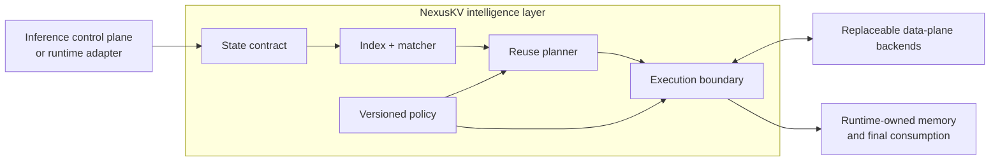

<h1 align="center">NexusKV</h1>

<p align="center">
  <strong>NexusKV is a model-state intelligence layer for inference systems.</strong>
</p>

<p align="center">
  <a href="https://github.com/imReese/NexusKV/actions/workflows/ci.yml"></a>
  <a href="LICENSE"></a>
  
  
  
</p>

<p align="center">
  <a href="README_CN.md">简体中文</a> ·
  <a href="#why-nexuskv">Why NexusKV</a> ·
  <a href="#architecture">Architecture</a> ·
  <a href="#current-implementation">Current implementation</a> ·
  <a href="#try-it-locally">Try it</a> ·
  <a href="#documentation">Docs</a> ·
  <a href="#validation">Validation</a>
</p>

Reusable model state is more than a cache hit. Its identity, compatibility,
reusable extent, location, transfer cost, and safe consumption rules all matter.
NexusKV makes those facts explicit so an inference system can evaluate reuse
without embedding state policy into one runtime or one data plane.

> **NexusKV answers what state can be reused, how much can be reused, and which
> execution path is admissible. The inference control plane and runtime retain
> placement, allocation, and final-consumption authority.**

> [!NOTE]
> NexusKV is pre-1.0. The repository contains executable contracts, a concurrent
> matcher, a bounded local store, deterministic planning and execution paths,
> and reference control-plane and integration surfaces. CI does not establish
> native accelerator materialization, physical RDMA transfer, multi-node
> production readiness, or live-runtime performance.

## Why NexusKV?

Inference runtimes are good at owning device memory, block tables, kernels, and
request-local scheduling. Data-plane systems are good at storing and moving
bytes. A reusable-state decision sits between them: a byte range is useful only
when its semantic identity, physical layout, lineage, and materialization path
are compatible with the request and destination.

NexusKV provides a shared boundary for:

- versioned state identity, layout, compatibility, and capability contracts;
- exact and longest-prefix discovery with explicit partial-hit plans;
- reuse, recompute, prefetch, store, and fallback decisions;
- payload handles and transfer-session records that do not confuse intent with
  completed byte movement;
- policy and backend capability filtering; and
- structured evidence from lookup through execution outcome.

The contracts can describe paged attention state and other typed reusable model
artifacts. Support for a state kind means its compatibility and materialization
rules are implemented and validated—not merely that a label exists in a schema.

## Architecture



| Boundary | Ownership |
| --- | --- |
| Inference control plane | Request admission, global compute/state placement, and orchestration |
| Inference runtime | Device allocation, block/page tables, streams, kernels, and final state consumption |
| Runtime adapter | Lifecycle translation, descriptor construction, and the final safety handoff |
| NexusKV | State compatibility, discovery, reuse planning, execution intent, fallback, and evidence |
| Data plane | Payload capacity, registration, physical transfer, completion, and backend-specific failure reporting |

NexusKV is composable with different control planes, runtimes, stores, and
transport implementations. Runtime-specific types stay at the edges.

## Design invariants

- **Typed identity:** tenant, namespace, immutable model identity, state
  semantics, lineage, layout, and parallel scope participate in compatibility
  whenever correctness depends on them.
- **Fail-closed compatibility:** missing or ambiguous evidence never becomes an
  optimistic reuse decision.
- **Match is not materialization:** metadata discovery, payload availability,
  transfer completion, and runtime consumption remain distinct states.
- **Runtime authority:** NexusKV does not seize allocator or kernel ownership
  from the inference runtime.
- **Replaceable data plane:** storage and transport capabilities are selected
  through contracts instead of hard-coded into connectors.
- **Evidence before performance claims:** deterministic fixtures, live runtimes,
  and physical hardware are reported as separate validation levels.

## Current implementation

| Area | What exists in this repository | Evidence boundary |
| --- | --- | --- |
| State contract | Versioned JSON schemas plus generated Rust and Python types for state identity, descriptors, payload handles, and transfer sessions | Schema/codegen and deterministic contract tests |
| Matcher | Rust exact and longest-prefix lookup, partial-hit planning, and concurrent copy-on-write updates | Deterministic lookup tests plus a concurrent insertion test |
| Store | Bounded Host DRAM payload storage with identity isolation and capacity behavior | In-process byte-preserving tests; not a distributed store |
| Planner and execution | Python cost primitives, capability-aware backend selection, deterministic actions, structured fallback, and background asynchronous prefetch simulation | Baseline in-memory behavior; staged-copy and remote-store paths remain stubs |
| Integrations | Python planner bridge, lifecycle-aware runtime connector surfaces, and the versioned Locus HTTP bridge | Deterministic protocol evidence here and paired cross-process evidence in Locus; no native engine-state import |
| Control plane | Go gRPC topology API, consistent-hash Raft FSM, BoltDB-backed single-node bootstrap, health probing, and versioned execution-policy handoff | Control-plane foundation; multi-node operation and production recovery are not qualified |

The architecture deliberately keeps unfinished data movement behind the
execution boundary. A successful stub response proves protocol behavior, not
physical movement into accelerator memory.

## Try it locally

The default test gate needs no model download, hosted API key, accelerator, or
inference runtime. Install the toolchains described in the
[Quickstart](docs/quickstart.md), then run:

```bash
git clone https://github.com/imReese/NexusKV.git
cd NexusKV
make test
```

The same areas can be checked independently:

```bash
GOTOOLCHAIN=go1.25.9 go test ./...
(cd rust && cargo test --workspace --locked)
PYTHONPATH=python python3 -m unittest discover -s python/tests -p "test_*.py"
python3 tools/generate_contracts.py --check
```

These commands exercise local deterministic and CPU-only paths. Their topology,
transfer, and hardware descriptors are fixtures unless a test explicitly says
it uses a live backend.

## Current integrations

Specific integrations are replaceable edge implementations, not the definition
of NexusKV:

| Boundary | Current surface | What it establishes |
| --- | --- | --- |
| Planner bridge | PyO3 binding to the Rust matcher | Real language boundary with versioned planner inputs and outputs |
| Runtime adapters | Lifecycle-aware SGLang and vLLM connector surfaces | Deterministic lifecycle and execution-boundary conformance, not live-runtime certification |
| Inference control plane | Versioned Locus lookup/estimate/materialize HTTP bridge | Protocol compatibility and capability binding; the paired Locus suite adds cross-process orchestration evidence, while physical transfer remains unverified |
| Data-plane backends | Baseline in-memory backend plus staged-copy and remote-store stubs | Selection, fallback, payload-handle, and transfer-session semantics |

## Documentation

| If you want to… | Read |
| --- | --- |
| Understand system ownership and component boundaries | [Architecture](docs/design/nexuskv-architecture.md) |
| Understand state identity and compatibility | [Attention State Descriptor](docs/design/attention-state-descriptor.md) · [Shared Schema](docs/design/shared-schema.md) |
| Follow matching and partial-hit planning | [nxradixtree](docs/design/nxradixtree.md) · [Python/Rust Planner Bridge](docs/design/python-rust-planner-bridge.md) |
| Implement an execution backend | [Execution Boundary](docs/design/execution-boundary.md) · [Payload Transfer Contract](docs/design/payload-transfer-contract.md) · [Backend Catalog](docs/design/transport-backend-catalog.md) |
| Integrate an inference control plane | [Locus Bridge](docs/design/locus-bridge.md) |
| Evaluate current evidence and future direction | [Whitepaper: Implementation Status](docs/papers/beyond-kv-cache.md#implementation-status) · [Roadmap](docs/roadmap.md) |

## Repository map

| Path | Responsibility |
| --- | --- |
| `schema/` | Versioned state, execution-policy, and integration contracts |
| `rust/crates/nexus-state` | Canonical Rust state and planner types |
| `rust/crates/nxradixtree-core` | Reuse index, matcher, and partial-hit planning |
| `rust/crates/nexus-store` | Bounded local payload and memory primitives |
| `rust/crates/nexus-transfer` | Runtime-owned region and transfer contract primitives |
| `rust/crates/bindings-py` | Python bridge to the Rust planner |
| `python/nexuskv` | Adapters, planning, execution policy, backend catalog, and integration services |
| `pkg/` and `cmd/server` | Go control-plane foundation and server assembly |
| `docs/` | Architecture, contracts, validation boundaries, roadmap, and research direction |

## Development

The main GitHub Actions gate runs Go tests on Linux and macOS, Rust formatting,
strict Clippy and workspace tests, Python 3.11/3.12 tests on Linux and macOS,
contract code generation, deterministic benchmark utilities, topology fixtures,
and a Docker build check.

Before submitting a change, run:

```bash
make fmt
make test
```

Changes to state identity, compatibility, payload, or transfer semantics should
start from the versioned schemas and preserve generated Rust/Python parity.

## Validation

NexusKV keeps protocol evidence separate from live-system and hardware evidence:

| Evidence level | GitHub CI | What it establishes |
| --- | --- | --- |
| Static and deterministic | Yes | Schemas, codegen parity, matching, policy, action ordering, fallback, and local store behavior |
| Concurrency and local HTTP protocol | Yes | Concurrent matcher behavior and versioned bridge requests over a real local socket |
| CPU-only topology fixtures | Yes | Descriptor math, policy branches, and simulated control flow—not physical multi-accelerator execution |
| Live inference runtime | No | Native runtime hooks, allocator integration, and model-correct state consumption |
| Physical data movement | No | DMA, RDMA, GPUDirect, remote networking, and verified transferred bytes |
| Production cluster | No | Multi-node recovery, tenant isolation, sustained load, tail latency, and operational readiness |

## Scope

NexusKV is not:

- an inference runtime or replacement for engine-local scheduling;
- a global inference placement control plane;
- a general-purpose distributed database;
- a transport fabric by itself; or
- a claim that every state kind, runtime, or hardware path named in the design
  documents is already implemented.

## License

NexusKV is licensed under the [Apache License 2.0](LICENSE).
