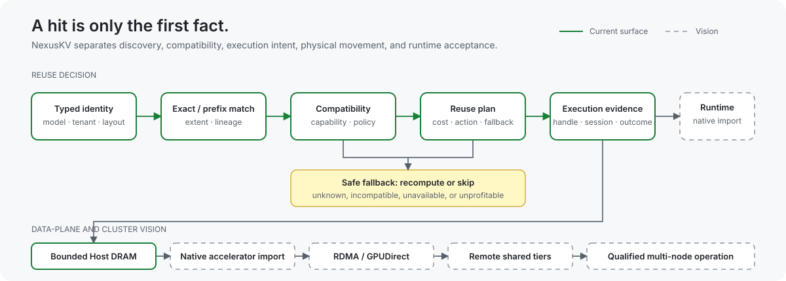

<h1 align="center">NexusKV</h1>

  <strong>Make model-state reuse a correctness decision—not a cache-hit guess.</strong>

  Engine-neutral contracts and decision logic for identifying, matching, planning, 
  and safely materializing reusable state in inference systems.

  
  
  
  
  

  <a href="README_CN.md">简体中文</a> ·
  <a href="#a-hit-is-only-the-first-fact">Core idea</a> ·
  <a href="#follow-a-reuse-decision">Decision flow</a> ·
  <a href="#try-the-deterministic-core">Quickstart</a> ·
  <a href="#what-runs-today">Current status</a> ·
  <a href="#evidence-boundaries">Validation</a> ·
  <a href="#documentation-by-task">Docs</a>

  

  <strong>Product vision:</strong> solid borders are current repository surfaces; dashed borders are designed but not yet qualified paths.

Matching tokens is easy. Knowing whether their model state is compatible,
complete, reachable, economical to reuse, and safe for a runtime to consume is
the harder systems problem.

NexusKV gives inference control planes and runtime adapters a shared language
for that decision. It answers **what state matches, how much is reusable, and
which execution path is admissible**. The inference runtime retains authority
over destination allocation and final consumption; replaceable data-plane
backends retain authority over physical bytes.

> [!IMPORTANT]
> NexusKV is pre-1.0. Today the repository proves contracts, matching, bounded
> local storage, deterministic action selection, fallback, and integration
> protocols. It does not yet prove native accelerator materialization, physical
> RDMA transfer, live-runtime correctness, or multi-node production readiness.

## A hit is only the first fact

A reusable-state system must answer several questions before saving any model
work:

| Question | NexusKV representation | Failure if ignored |
| --- | --- | --- |
| Is this the same state? | Tenant, namespace, model revision, semantic kind, lineage, layout, dtype, quantization, and parallel scope | Silent cross-model or cross-tenant corruption |
| How much is reusable? | Exact/longest-prefix match, matched extent, and explicit partial-hit plan | Reusing beyond the valid boundary |
| Can the destination consume it? | Capabilities, target tier/device/buffer constraints, and runtime handoff | A metadata hit that cannot execute |
| Is reuse better than recompute? | Cost inputs, policy, topology, and fallback disposition | Moving state that costs more than rebuilding it |
| Did bytes actually arrive? | Payload handles, transfer sessions, completion evidence, and final runtime acceptance | Treating intent as completed movement |

This is why NexusKV models **match**, **plan**, **materialization**, and
**consumption** as distinct stages.

## Follow a reuse decision

~~~mermaid
flowchart LR
    query["Typed state query"]
    match["Exact or prefix match"]
    check{"Compatible and admissible?"}
    plan{"Reuse is worth the path?"}
    action["Materialize / prefetch or route to state"]
    fallback["Recompute or skip"]
    receipt["Payload handle + transfer session"]
    runtime["Runtime validates and consumes state"]

    query --> match --> check
    check -- no --> fallback
    check -- yes --> plan
    plan -- no --> fallback
    plan -- yes --> action --> receipt --> runtime
~~~

The important state transitions are explicit:

- a MatchResult proves discovery, not byte availability;
- a PartialHitPlan identifies reusable and remaining work, not profitability;
- a materialization decision records intent, not transfer completion;
- a TransferSession carries observable progress and outcome metadata; and
- only the runtime can accept state into runtime-owned memory for model
  execution.

## Try the deterministic core

The default repository gate needs no model download, hosted API key,
accelerator, inference runtime, or remote storage service:

~~~bash
git clone https://github.com/imReese/NexusKV.git
cd NexusKV
make test
~~~

It runs the Go, Rust, and Python suites plus CPU-only topology and read/write
precision fixtures. To isolate the main layers:

~~~bash
GOTOOLCHAIN=go1.25.9 go test ./...
(cd rust && cargo test --workspace --locked)
PYTHONPATH=python python3 -m unittest discover -s python/tests -p "test_*.py"
python3 tools/generate_contracts.py --check
~~~

These are deterministic development checks. Hardware and topology descriptors
inside them are fixtures unless a test explicitly connects to a live backend.

## What runs today

| Layer | Working implementation | What remains outside the claim |
| --- | --- | --- |
| State contract | Versioned JSON schemas plus generated Rust and Python types for identity, descriptors, payload handles, and transfer sessions | A schema label alone does not qualify a state kind or hardware path |
| Index and matcher | Rust exact and longest-prefix lookup, explicit partial-hit planning, and concurrent copy-on-write updates | Profitability, destination reservation, and byte movement |
| Local store | Bounded Host DRAM payload storage with identity isolation and capacity behavior | Distributed durability or a production storage service |
| Planner boundary | Rust matcher exposed through a thin PyO3 bridge with deterministic planner inputs and outputs | A fully calibrated production cost model |
| Execution boundary | Capability/policy-aware backend selection, structured actions, fallback, payload handles, and transfer-session records | Staged-copy and remote-store paths are stubs, not physical transfers |
| Runtime edges | Lifecycle-aware SGLang and vLLM connector surfaces | Native live-engine state import and model-correct consumption |
| Control-plane edge | Versioned policy handoff, topology/control APIs, and a single-node foundation | Multi-node recovery and production cluster operation are not qualified |
| Locus integration | Versioned lookup/estimate/materialize HTTP bridge backed by the Rust matcher | Cross-process protocol evidence is zero-byte; physical state movement remains unverified |

## Where NexusKV sits

~~~text
Inference control plane
  owns admission and global request placement
            │
            ▼
Runtime adapter
  translates lifecycle and constructs typed descriptors
            │
            ▼
NexusKV
  identity → match → reuse plan → execution intent → evidence
            │                                      │
            ▼                                      ▼
Data-plane backend                         Inference runtime
  stores and moves bytes                     allocates and consumes
~~~

NexusKV is the intelligence layer in the middle:

- **Control planes** decide where the whole inference request should run.
- **Runtime adapters** translate engine lifecycle events and perform the final
  safety handoff.
- **NexusKV** owns compatibility, discovery, reuse planning, action selection,
  deterministic fallback, and outcome evidence.
- **Data planes** own payload capacity, registration, transfer, completion, and
  backend-specific failures.
- **Inference runtimes** own device allocation, block/page tables, streams,
  kernels, and final state consumption.

Runtime-specific types stay at the edges, and no match can override a failed
compatibility, authorization, policy, or capability check.

## Beyond a single KV-cache shape

The contracts are designed to describe typed reusable model artifacts rather
than hard-coding one attention layout:

| Contract dimension | Examples of what can matter |
| --- | --- |
| Semantic identity | Model and adapter revision, tokenizer/template identity, state kind, tenant/namespace |
| Logical extent | Tokens, pages, blocks, layers, checkpoint lineage, reusable boundary |
| Physical layout | Tensor shape, dtype, quantization, stride, parallel partition |
| Location | Device, Host DRAM, local SSD, remote shared tier, topology |
| Materialization | Supported transfer path, destination capability, partial-reuse support |
| Evidence | Match classification, selected action, fallback reason, payload handle, transfer outcome |

The abstraction can represent paged attention state and future typed artifacts.
Representation is not implementation: each state kind still needs concrete
compatibility rules, materialization logic, and validation before it is called
supported.

## Integration surfaces

| Consumer or boundary | Current surface | Evidence |
| --- | --- | --- |
| Python planning | PyO3 binding to the Rust matcher | Real language boundary with versioned planner results |
| SGLang and vLLM adapters | Lifecycle-aware connector surfaces | Deterministic lifecycle/execution conformance only |
| Locus control plane | Versioned HTTP bridge for lookup, estimate, and materialize | Local HTTP here plus paired cross-process orchestration in Locus |
| Storage/transport backends | Baseline in-memory backend and staged/remote stubs | Selection, fallback, and record semantics; no physical remote transfer |
| Go control plane | Versioned execution policy and topology foundation | Local contract/control behavior; no production multi-node claim |

## Evidence boundaries

| Evidence level | In GitHub CI | Establishes |
| --- | --- | --- |
| Static and deterministic | Yes | Schema parity, matching, action ordering, policy, fallback, and local store behavior |
| Concurrency and local HTTP | Yes | Concurrent matcher behavior and versioned bridge transport through a real socket |
| CPU-only topology fixtures | Yes | Descriptor math and simulated control flow, not multi-accelerator execution |
| Live inference runtime | No | Native hooks, allocator integration, and model-correct state consumption |
| Physical data movement | No | DMA, RDMA, GPUDirect, remote networking, and verified transferred bytes |
| Production cluster | No | Multi-node recovery, tenant isolation, sustained load, tail latency, and operations |

Performance claims belong with reproducible workload, hardware, configuration,
and methodology. See [Benchmark Methodology](docs/benchmarks/benchmark-methodology.md);
do not treat simulator throughput or descriptor math as serving performance.

## Documentation by task

| If you want to… | Read |
| --- | --- |
| Understand ownership and component boundaries | [Architecture](docs/design/nexuskv-architecture.md) |
| Define identity and compatibility | [Attention State Descriptor](docs/design/attention-state-descriptor.md) · [Shared Schema](docs/design/shared-schema.md) |
| Work on matching and partial hits | [nxradixtree](docs/design/nxradixtree.md) · [Python/Rust Planner Bridge](docs/design/python-rust-planner-bridge.md) |
| Implement a real backend | [Execution Boundary](docs/design/execution-boundary.md) · [Payload Transfer Contract](docs/design/payload-transfer-contract.md) · [Backend Catalog](docs/design/transport-backend-catalog.md) |
| Connect an inference control plane | [Locus Bridge](docs/design/locus-bridge.md) |
| Separate implementation from research direction | [Implementation Status](docs/papers/beyond-kv-cache.md#implementation-status) · [Migration Status](docs/architecture/migration-status.md) · [Roadmap](docs/roadmap.md) |

## Development

Before submitting a change:

~~~bash
make fmt
make test
~~~

Changes to identity, compatibility, payload, or transfer semantics should begin
from the versioned schemas and preserve generated Rust/Python parity. The main
CI matrix also checks supported Go/Rust/Python environments, deterministic
benchmark utilities, topology fixtures, and a Docker build.

## Scope

NexusKV is not an inference runtime, a global request-placement control plane, a
general-purpose distributed database, or a transport fabric by itself. It does
not claim that every state kind, runtime, topology, or hardware path named in a
design document is implemented.

## License

NexusKV is licensed under the [Apache License 2.0](LICENSE).
