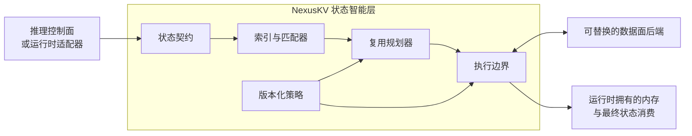

<h1 align="center">NexusKV</h1>

<p align="center">
  <strong>NexusKV 是面向推理系统的引擎中立模型状态智能层。</strong>
</p>

<p align="center">
  <a href="https://github.com/imReese/NexusKV/actions/workflows/ci.yml"></a>
  <a href="LICENSE"></a>
  
  
  
</p>

<p align="center">
  <a href="README.md">English</a> ·
  <a href="#为什么需要-nexuskv">为什么需要 NexusKV</a> ·
  <a href="#架构">架构</a> ·
  <a href="#当前实现">当前实现</a> ·
  <a href="#本地体验">本地体验</a> ·
  <a href="#文档">文档</a> ·
  <a href="#验证边界">验证边界</a>
</p>

可复用模型状态不只是一次缓存命中。状态身份、兼容性、可复用范围、
所在位置、传输成本和安全消费规则都会影响最终决策。NexusKV 将这些事实
显式化，让推理系统能够评估状态复用，而不必把状态策略绑定到某个运行时
或某个数据面实现中。

> **NexusKV 回答哪些状态可以复用、可以复用多少，以及哪些执行路径满足
> 条件。推理控制面与运行时继续拥有放置、内存分配和最终消费的决定权。**

> [!NOTE]
> NexusKV 目前处于 pre-1.0 阶段。仓库已经包含可执行契约、并发匹配器、
> 有界本地存储、确定性规划与执行路径，以及参考控制面和集成接口。
> CI 并不能证明原生加速器状态物化、真实 RDMA 传输、多节点生产就绪性，
> 或真实推理运行时性能。

## 为什么需要 NexusKV？

推理运行时擅长管理设备内存、块表、内核和请求内调度；数据面系统擅长
保存和移动字节。状态复用决策位于二者之间：只有当语义身份、物理布局、
状态谱系和物化路径都与请求及目标兼容时，一段数据才真正可用。

NexusKV 提供一组共享边界：

- 版本化的状态身份、布局、兼容性与能力契约；
- 精确匹配、最长前缀发现和显式部分命中计划；
- 复用、重算、预取、存储与降级决策；
- 不会把“传输意图”误报为“字节已移动”的 Payload Handle 与 Transfer Session；
- 策略与后端能力过滤；
- 从查询、匹配到执行结果的结构化证据。

这些契约能够描述分页 Attention 状态以及其他有类型的可复用模型产物。
一个状态类型只有在兼容和物化规则都已实现并验证后，才能称为受支持；
Schema 中存在一个标签并不等于已经支持。

## 架构



| 边界 | 职责归属 |
| --- | --- |
| 推理控制面 | 请求准入、全局计算/状态放置与编排 |
| 推理运行时 | 设备分配、块/页表、Stream、Kernel 与最终状态消费 |
| 运行时适配器 | 生命周期翻译、Descriptor 构造与最终安全交接 |
| NexusKV | 状态兼容、发现、复用规划、执行意图、降级与证据 |
| 数据面 | Payload 容量、注册、物理传输、完成状态与后端故障报告 |

NexusKV 可以与不同的控制面、运行时、存储和传输实现组合使用。
运行时专属类型只停留在系统边缘。

## 设计不变量

- **有类型的身份：** 当正确性依赖租户、命名空间、不可变模型身份、状态语义、
  谱系、布局或并行域时，这些事实必须参与兼容判断。
- **兼容性 Fail-Closed：** 缺失或含糊的证据不会被乐观解释为可复用。
- **匹配不等于物化：** 元数据发现、Payload 可用、传输完成和运行时消费是
  四个不同状态。
- **运行时拥有最终权力：** NexusKV 不接管推理运行时的分配器或 Kernel。
- **数据面可替换：** 存储和传输能力通过契约选择，不硬编码进 Connector。
- **性能结论以证据为先：** 确定性 Fixture、真实运行时和物理硬件属于不同
  验证等级，不能相互替代。

## 当前实现

| 领域 | 仓库中已经存在的实现 | 证据边界 |
| --- | --- | --- |
| 状态契约 | 版本化 JSON Schema，以及状态身份、Descriptor、Payload Handle、Transfer Session 对应的 Rust/Python 生成类型 | Schema/代码生成一致性与确定性契约测试 |
| 匹配器 | Rust 精确/最长前缀查询、部分命中规划和并发写时复制更新 | 确定性查询测试，以及并发插入测试 |
| 存储 | 有界 Host DRAM Payload 存储、身份隔离与容量行为 | 进程内字节保持测试；不是分布式存储 |
| 规划与执行 | Python 成本计算原语、能力感知后端选择、确定性动作、结构化降级与后台异步预取模拟 | 基线为内存内实现；staged-copy 和 remote-store 仍是 Stub |
| 集成 | Python Planner Bridge、生命周期感知的运行时 Connector 接口，以及版本化 Locus HTTP Bridge | 本仓库提供确定性协议证据，Locus 配套测试提供跨进程证据；不含原生引擎状态导入 |
| 控制面 | Go gRPC 拓扑 API、一致性哈希 Raft FSM、BoltDB 持久化的单节点启动路径、健康探测与版本化执行策略交接 | 控制面基础；尚未验证多节点运行与生产恢复 |

架构刻意把尚未完成的数据移动隐藏在执行边界之后。Stub 返回成功只能证明
协议行为，不能证明状态已经物理移动到加速器内存。

## 本地体验

默认测试门禁不需要下载模型、托管 API Key、加速器或推理运行时。先按照
[快速上手指南](docs/quickstart_cn.md)安装工具链，然后运行：

```bash
git clone https://github.com/imReese/NexusKV.git
cd NexusKV
make test
```

也可以分别验证各实现区域：

```bash
GOTOOLCHAIN=go1.25.9 go test ./...
(cd rust && cargo test --workspace --locked)
PYTHONPATH=python python3 -m unittest discover -s python/tests -p "test_*.py"
python3 tools/generate_contracts.py --check
```

这些命令覆盖本地确定性与 CPU-only 路径。除非测试明确声明连接真实后端，
其中的拓扑、传输和硬件 Descriptor 都应视为 Fixture。

## 当前集成

具体集成是可替换的边缘实现，不是 NexusKV 的定义：

| 边界 | 当前接口 | 能证明什么 |
| --- | --- | --- |
| Planner Bridge | Rust 匹配器的 PyO3 Binding | 真实语言边界上的版本化 Planner 输入与输出 |
| 运行时适配器 | 生命周期感知的 SGLang 与 vLLM Connector 接口 | 确定性生命周期和执行边界一致性；不是 Live Runtime 认证 |
| 推理控制面 | 版本化 Locus lookup/estimate/materialize HTTP Bridge | 协议兼容与能力绑定；配套 Locus 测试补充跨进程编排证据，物理传输仍未验证 |
| 数据面后端 | 基线内存后端，以及 staged-copy、remote-store Stub | 后端选择、降级、Payload Handle 与 Transfer Session 语义 |

## 文档

| 如果你希望…… | 阅读 |
| --- | --- |
| 理解系统职责和组件边界 | [架构](docs/design/nexuskv-architecture_cn.md) |
| 理解状态身份与兼容性 | [Attention 状态描述符](docs/design/attention-state-descriptor_cn.md) · [共享 Schema](docs/design/shared-schema_cn.md) |
| 跟踪匹配与部分命中规划 | [nxradixtree](docs/design/nxradixtree_cn.md) · [Python/Rust Planner Bridge](docs/design/python-rust-planner-bridge_cn.md) |
| 实现执行后端 | [执行边界](docs/design/execution-boundary_cn.md) · [Payload 传输契约](docs/design/payload-transfer-contract_cn.md) · [后端目录](docs/design/transport-backend-catalog_cn.md) |
| 集成推理控制面 | [Locus Bridge](docs/design/locus-bridge.md) |
| 评估当前证据和未来方向 | [白皮书：实现状态](docs/papers/beyond-kv-cache_cn.md#implementation-status-实现状态说明) · [路线图](docs/roadmap_cn.md) |

## 仓库结构

| 路径 | 职责 |
| --- | --- |
| `schema/` | 版本化状态、执行策略和集成契约 |
| `rust/crates/nexus-state` | Rust 规范状态与 Planner 类型 |
| `rust/crates/nxradixtree-core` | 复用索引、匹配器与部分命中规划 |
| `rust/crates/nexus-store` | 有界本地 Payload 与内存原语 |
| `rust/crates/nexus-transfer` | 运行时拥有内存区域与传输契约原语 |
| `rust/crates/bindings-py` | Rust Planner 的 Python Bridge |
| `python/nexuskv` | 适配器、规划、执行策略、后端目录与集成服务 |
| `pkg/` 与 `cmd/server` | Go 控制面基础与 Server 装配 |
| `docs/` | 架构、契约、验证边界、路线图与研究方向 |

## 开发

主 GitHub Actions 门禁在 Linux 和 macOS 上运行 Go 测试、Rust 格式检查、
严格 Clippy 与 Workspace 测试、Python 3.11/3.12 测试，同时检查契约代码生成、
确定性 Benchmark 工具、拓扑 Fixture 和 Docker 构建。

提交变更前运行：

```bash
make fmt
make test
```

修改状态身份、兼容性、Payload 或传输语义时，应从版本化 Schema 开始，
并保持 Rust/Python 生成类型一致。

## 验证边界

NexusKV 将协议证据、真实系统证据和硬件证据分开报告：

| 证据等级 | GitHub CI | 能证明什么 |
| --- | --- | --- |
| 静态与确定性 | 是 | Schema、代码生成一致性、匹配、策略、动作顺序、降级与本地存储行为 |
| 并发与本地 HTTP 协议 | 是 | 并发匹配器行为，以及通过真实本地 Socket 的版本化 Bridge 请求 |
| CPU-only 拓扑 Fixture | 是 | Descriptor 数学、策略分支与模拟控制流；不是物理多加速器执行 |
| 真实推理运行时 | 否 | 原生 Runtime Hook、分配器集成和模型正确的状态消费 |
| 物理数据移动 | 否 | DMA、RDMA、GPUDirect、远程网络和经验证的传输字节数 |
| 生产集群 | 否 | 多节点恢复、租户隔离、持续负载、尾延迟与运维就绪性 |

## 范围

NexusKV 不是：

- 推理运行时或引擎内调度器的替代品；
- 全局推理放置控制面；
- 通用分布式数据库；
- 自身即可完成物理传输的数据 Fabric；
- “设计文档中出现的每种状态、运行时或硬件路径都已经实现”的声明。

## 许可证

NexusKV 采用 [Apache License 2.0](LICENSE) 许可证。
