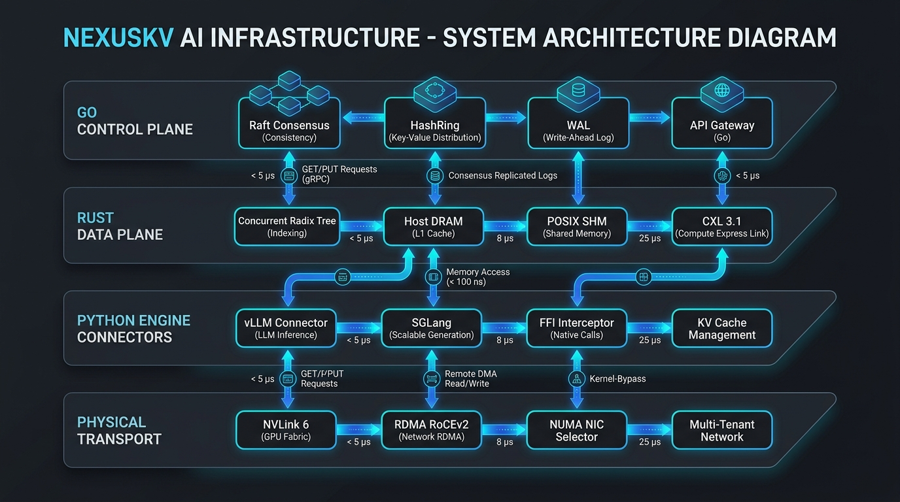
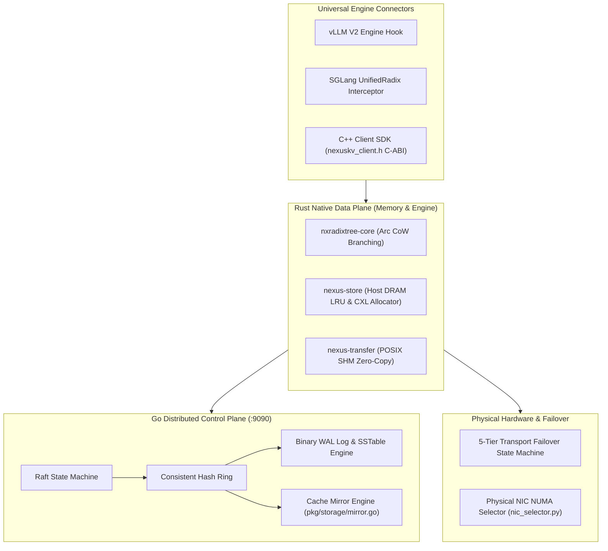

# NexusKV 工业级架构白皮书与系统设计规范 (Technical Whitepaper)

NexusKV 是专为分布式大语言模型 (LLM) 推理集群设计的 **模型状态智能感知与超高性能 KV Cache 存储/路由引擎**。

---

## 1. 系统架构总览 (System Architecture Overview)

NexusKV 采用 **控制面 (Control Plane) 与数据面 (Data Plane) 严格解耦** 的分层设计，确保元数据高度一致性与微秒级显存/内存数据直传。



### 1.1 纯文本 Unicode 架构拓扑 (Text Topology Diagram)

```text
┌──────────────────────────────────────────────────────────────────────────────────────────────────┐
│                               GO DISTRIBUTED CONTROL PLANE                                       │
│  ┌───────────────────────┐   ┌────────────────────────┐   ┌───────────────────────────────────┐  │
│  │ Raft Consensus Engine │ ──│ HashRing Migration Plan│ ──│ Storage WAL & SSTable Engine      │  │
│  │ (Raft Leader / State) │   │ (Consistent Hashing)   │   │ (LSMTree & BPlusTree Fsync)       │  │
│  └───────────────────────┘   └────────────────────────┘   └───────────────────────────────────┘  │
└──────────────────────────────────────────────────────────────────────────────────────────────────┘
                                              │ (Metadata RPC / :9090 gRPC)
                                              ▼
┌──────────────────────────────────────────────────────────────────────────────────────────────────┐
│                                RUST NATIVE DATA PLANE                                            │
│  ┌───────────────────────┐   ┌────────────────────────┐   ┌───────────────────────────────────┐  │
│  │ nxradixtree-core      │   │ nexus-store            │   │ nexus-transfer                    │  │
│  │ (Agentic CoW Branching│   │ (Host DRAM LRU & Block │   │ (POSIX SHM Zero-Copy & CXL 3.1    │  │
│  │  fork_branch() Arc)   │   │  Allocators)           │   │  UALink 2.0 Fabric Drivers)       │  │
│  └───────────────────────┘   └────────────────────────┘   └───────────────────────────────────┘  │
└──────────────────────────────────────────────────────────────────────────────────────────────────┘
                                              │ (PyO3 C-ABI FFI Interceptor / <100ns)
                                              ▼
┌──────────────────────────────────────────────────────────────────────────────────────────────────┐
│                           UNIVERSAL PYTHON & C++ CONNECTORS                                      │
│  ┌───────────────────────┐   ┌────────────────────────┐   ┌───────────────────────────────────┐  │
│  │ vLLM V2 Engine Hook   │   │ SGLang UnifiedRadix    │   │ C++ Header-Only Client SDK        │  │
│  │ (PagedAttention V2)   │   │ Interceptor Hook       │   │ (nexuskv_client.h C-ABI dlopen)   │  │
│  └───────────────────────┘   └────────────────────────┘   └───────────────────────────────────┘  │
└──────────────────────────────────────────────────────────────────────────────────────────────────┘
                                              │ (Physical Transport Layer)
                                              ▼
┌──────────────────────────────────────────────────────────────────────────────────────────────────┐
│                           PHYSICAL TRANSPORT & HARDWARE TOPOLOGY                                 │
│  ┌───────────────────────┐   ┌────────────────────────┐   ┌───────────────────────────────────┐  │
│  │ NVLink 6 Fabric       │   │ RDMA RoCEv2 (Mooncake) │   │ Physical NIC Selector             │  │
│  │ (Rubin CPX 3.6TB/s)   │   │ (400Gbps PFC/ECN TC)   │   │ (sysfs / NUMA Node Alignment)     │  │
│  └───────────────────────┘   └────────────────────────┘   └───────────────────────────────────┘  │
└──────────────────────────────────────────────────────────────────────────────────────────────────┘
```

### 1.2 GitHub Native Mermaid 流程图 (Mermaid Workflow)



---

## 2. 5 级阶梯传输降级状态机 (5-Tier Transport Failover Ladder)

NexusKV 具备工业级高可用容错机制，在物理网络掉包或硬件句柄失效时，自动触发 5 级阶梯降级：

1. **Tier 1: CUDA_IPC (0.01ms 极速)** — 同机 NVLink / UVA 显存句柄零拷贝共享。
2. **Tier 2: NVLINK_NIXL (0.05ms)** — Multi-GPU NVLink Switch 织网高带宽调度。
3. **Tier 3: RDMA_ROCE (0.2ms)** — 跨机 400Gbps RDMA / Mooncake 传输引擎。
4. **Tier 4: HOST_DRAM_STAGED (0.5ms)** — CPU 锁页内存分级暂存与中转。
5. **Tier 5: FAIL_OPEN_RECOMPUTE (<1ms 终极保障)** — 自动熔断降级至本地 GPU Prefill 重算，**保证上层推理服务绝对不超时、不崩溃**。

---

## 3. Agentic 多分支 CoW 树分叉机制 (`fork_branch()`)

在 Multi-Turn Agentic 智能体交互场景中，多个分支 Agent 共享相同的 System Prompt 和历史 Context。NexusKV Rust `nxradixtree-core` 提供 Copy-on-Write (CoW) 零拷贝分支克隆：

```rust
// Agentic multi-branch zero-copy fork in nxradixtree-core
let shared_tree = RadixTree::new();
let branch_agent_a = shared_tree.fork_branch("agent_session_a");
let branch_agent_b = shared_tree.fork_branch("agent_session_b");
```

---

## 4. 全量环境变量控制矩阵 (Environment Variable Matrix)

| 环境变量 | 默认值 | 作用描述 |
| :--- | :--- | :--- |
| **`NEXUSKV_LOG_LEVEL`** | `INFO` | 日志输出级别 (`DEBUG`/`INFO`/`WARN`/`ERROR`) |
| **`NEXUSKV_PREFERRED_NIC`** | *(自动)* | 手动指定使用的物理 RDMA 网卡（如 `mlx5_0`） |
| **`NEXUSKV_IB_DEVICE_PREFIX`**| `mlx5_` | InfiniBand / RoCEv2 网卡设备扫描前缀 |
| **`NEXUSKV_IB_PORT`** | `1` | InfiniBand 物理网卡端口号 |
| **`NEXUSKV_IB_GID_INDEX`** | `3` | RoCEv2 GID 表项索引 |
| **`NEXUSKV_IB_TRAFFIC_CLASS`**| `106` | RoCEv2 DSCP 流量服务优先级（触发 PFC/ECN 零丢包） |
| **`NEXUSKV_GPU_DIRECT_RDMA`** | `true` | GPUDirect RDMA 显存直传开关 |
| **`NEXUSKV_FAIL_OPEN_MODE`** | `true` | <1ms Fail-Open 极速降级熔断保障开关 |
| **`NEXUSKV_TRANSPORT_TIMEOUT_MS`** | `1.0` | 传输层判定超时阈值（毫秒） |
| **`NEXUSKV_NUMA_AFFINITY`** | `-1` (自动) | 强制 CPU/GPU NUMA Node 亲和性绑定 |

---

## 5. 运维诊断与 MLOps 监控 (Observability & Operations)

### 5.1 CLI 诊断工具 (`nexuskv-cli`)
```bash
# 查看集群状态与指标
nexuskv-cli status

# 扫描物理 RDMA 网卡与 NUMA Node 对齐情况
nexuskv-cli nic

# 存活健康检查
nexuskv-cli health
```

### 5.2 Prometheus & Grafana 编排 (Docker Compose)
一键启动完整堆栈：
```bash
docker compose up -d
```
- **gRPC 服务**: `:9090`
- **Prometheus Metrics**: `http://localhost:9091/metrics`
- **Grafana 大屏**: `http://localhost:3000` (默认密码 `admin`)
