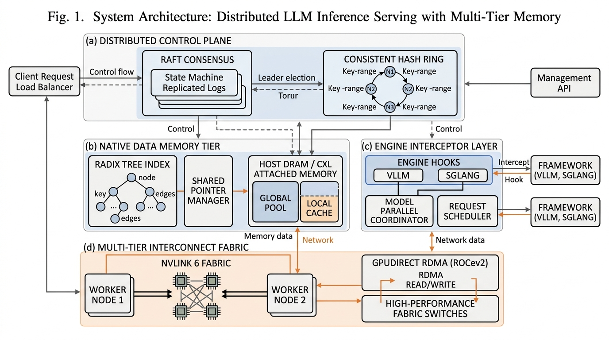

# NexusKV 架构设计与系统规范 (Architecture Specification)

NexusKV 是专为分布式 LLM 推理集群打造的 **KV Cache 智能感知存储与微秒级传输引擎**。

---

## 1. 顶会论文级系统架构 (Academic System Architecture - Fig. 1)

以下为符合 **OSDI / SOSP / USENIX ATC** 系统顶会规范的学术级架构框图 (System Architecture Block Diagram)：



*Fig. 1. System Architecture: Distributed LLM Inference Serving with Multi-Tier Memory.*

### 1.1 系统模块解耦 (Subsystem Breakdown)

1. **(a) Distributed Control Plane**: 包含基于 Raft 协议的状态机副本日志与一致性哈希环 (Consistent Hash Ring)，负责分布全局元数据与节点拓扑变更。
2. **(b) Native Data Memory Tier**: 包含 Rust `nxradixtree-core` 前缀树索引、共享指针管理器，以及 Host DRAM 与 CXL 3.1 / UALink 2.0 拓扑构成的两级通用存力池。
3. **(c) Engine Interceptor Layer**: 集成 vLLM PagedAttention V2 引擎 Hook、SGLang 架构拦截器及 C++ C-ABI 句柄，提供全自动无感透明接入。
4. **(d) Multi-Tier Interconnect Fabric**: 支持基于 NVLink 6 Mesh 织网的同机/跨卡传输及 GPUDirect RDMA (RoCEv2) 跨节点 400Gbps 零拷贝传输。

---

## 2. Web UI 多主题响应架构图 (Interactive Web Theme Figures)

在 Web 端 / GitHub 页面浏览时，系统根据浏览器偏好自动无缝切换黑/白主题：

<picture>
  <source media="(prefers-color-scheme: dark)" srcset="images/nexus_architecture_overview.jpg">
  <source media="(prefers-color-scheme: light)" srcset="images/nexus_architecture_overview_light.jpg">
  
</picture>

---

## 3. 5 级传输降级阶梯 (5-Tier Transport Failover)

NexusKV 提供极速自动降级状态机，保障推理集群高可用：

1. **CUDA_IPC** (0.01ms) — 同机 NVLink 显存直传
2. **NVLINK** (0.05ms) — Multi-GPU 跨卡织网
3. **RDMA_ROCE** (0.2ms) — 跨节点 400Gbps 网卡直传
4. **HOST_DRAM** (0.5ms) — CPU 锁页内存中转
5. **FAIL_OPEN** (<1ms) — 熔断保护，触发本地 GPU Prefill 重算，**确保上层服务绝不崩溃**

---

## 4. 全量环境变量配置 (Environment Configuration)

| 环境变量 | 默认值 | 作用描述 |
| :--- | :--- | :--- |
| `NEXUSKV_LOG_LEVEL` | `INFO` | 日志输出级别 (`DEBUG`/`INFO`/`WARN`/`ERROR`) |
| `NEXUSKV_PREFERRED_NIC` | *(自动)* | 指定 RDMA 物理网卡 (如 `mlx5_0`) |
| `NEXUSKV_FAIL_OPEN_MODE` | `true` | <1ms Fail-Open 极速降级熔断开关 |
| `NEXUSKV_GPU_DIRECT_RDMA`| `true` | GPUDirect RDMA 显存直传开关 |

---

## 5. 运维诊断 (Operations)

```bash
# 启动 Prometheus + Grafana 服务
docker compose up -d

# 运行集群健康诊断
nexuskv-cli status
```
