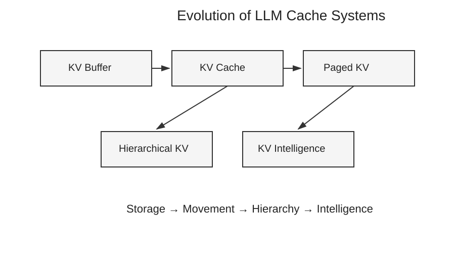
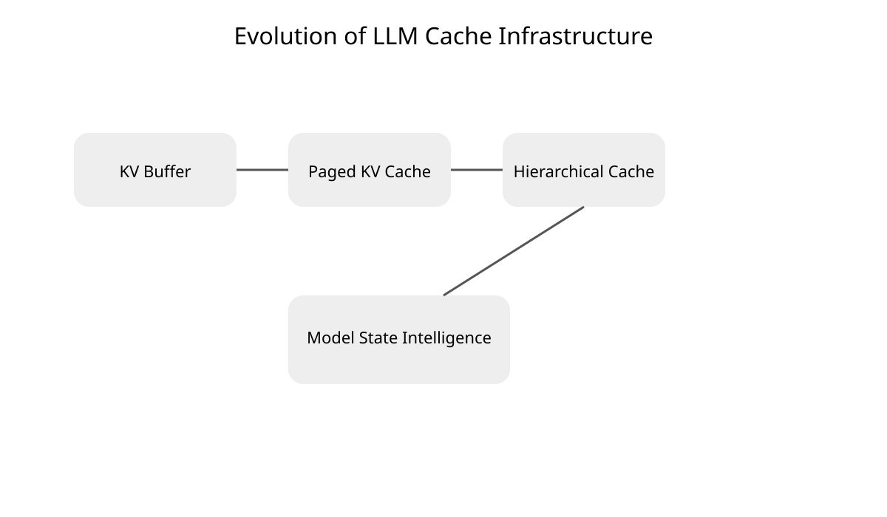
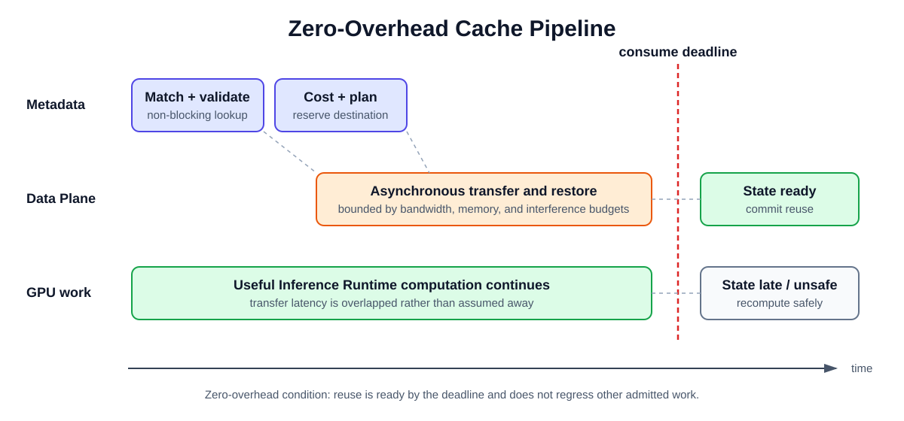
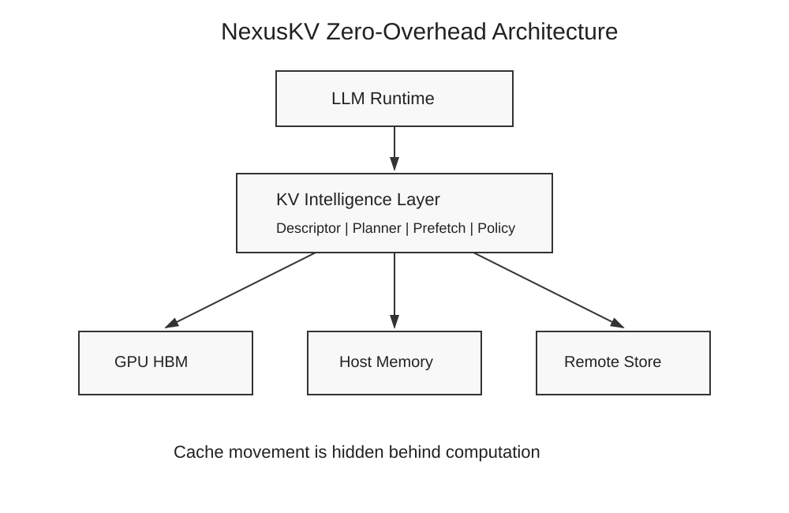

# NexusKV Whitepaper v1.0

## Beyond KV Cache: A Zero-Overhead Model State Intelligence Layer for LLM Inference

**Status:** Architecture whitepaper; August 2026

**Scope:** Model State Infrastructure for large language model inference

## Abstract

Key-value (KV) state has evolved from a private buffer inside an Inference
Runtime into a resource that may be reused across requests, memory tiers,
workers, and disaggregated prefill/decode clusters. Existing systems address
different parts of this evolution: vLLM manages paged device memory, SGLang
combines radix-based prefix reuse with hierarchical caching, LMCache provides a
cache middleware and lifecycle layer, and Mooncake supplies a distributed
storage and transfer Data Plane. These systems demonstrate that capacity and
movement are necessary, but neither a cache hit nor a completed transfer
guarantees an end-to-end improvement.

This paper studies the problem as **Model State Infrastructure**, not as a
survey of every inference optimization. It formally separates Cache State,
Reuse Decision, Placement Decision, and Transfer Decision; defines the visible
cost of reuse; and gives an optimization objective that maximizes useful reuse
rather than raw hit rate. The analysis identifies a missing coordination layer
that can describe state semantics, reject incompatible reuse, compare transfer
with recomputation, and schedule movement outside the critical path.

NexusKV is proposed as that **Intelligence Layer**. Its target is a
zero-overhead operating condition in which cache management consumes resources
but adds no latency to the request's critical path. The architecture generalizes
from conventional multi-head attention KV tensors to Model State produced by
multi-head latent, sparse, and recurrent attention. This document presents the
architecture and an evaluation methodology; it does not claim that the target
condition has already been demonstrated by the current implementation.

## Contents

- [1. Introduction](#1-introduction)
- [2. Problem Formulation](#2-problem-formulation)
- [3. Current KV Cache Landscape](#3-current-kv-cache-landscape)
- [4. Existing Systems](#4-existing-systems)
- [5. Why Existing Systems Are Not Enough](#5-why-existing-systems-are-not-enough)
- [6. Zero-Overhead Cache Architecture](#6-zero-overhead-cache-architecture)
- [7. Model State Cache](#7-model-state-cache)
- [8. NexusKV Architecture](#8-nexuskv-architecture)
- [9. Evaluation Methodology](#9-evaluation-methodology)
- [10. Limitations](#10-limitations)
- [11. Related Work](#11-related-work)
- [12. Conclusion](#12-conclusion)
- [References](#references)

**Supporting appendices:** [A — Related Work](related-work.md) ·
[B — System Coverage](kv-cache-system-coverage.md) ·
[C — Design Principles](design-principles.md) ·
[D — Limitations and Future Work](limitations-and-future-work.md) ·
[E — Research and Evaluation Notes](research-appendix.md) ·
[F — Figure Index](figure-integration-guide.md) ·
[BibTeX](bibliography.bib)

## 1. Introduction

Autoregressive inference avoids repeatedly computing attention keys and values
for preceding tokens by retaining them in a KV Cache. The original abstraction
was local:

```text
request -> model execution -> device-resident KV Cache
```

Longer contexts and shared workloads changed both the size and the lifetime of
that state. Multi-turn conversations revisit earlier prefixes; retrieval and
agent workloads reuse documents and tool histories; prefill/decode
disaggregation moves state between workers; and a cluster may expose GPU HBM,
host DRAM, local SSD, remote memory, and object storage as candidate tiers.
Meanwhile, newer model architectures no longer produce one uniform pair of K/V
tensors at every layer.

The resulting system problem is not simply how to store more bytes. It is how
to determine whether a particular state is correct and profitable to reuse,
where it should reside, when it should move, and what should happen when the
predicted reuse does not materialize.

This paper argues that these decisions require a layer above allocation,
storage, and transport: a **Model State Intelligence Layer**. The intended
relationship is compositional. An Inference Runtime continues to execute the
model; a storage system continues to own capacity and persistence; a transfer
library continues to move buffers; and the Intelligence Layer coordinates
those capabilities using Model State semantics and measured cost.

### 1.1 Scope

The scope of this paper is **Model State Infrastructure**:

- state identity and compatibility;
- local and distributed cache reuse;
- memory and storage hierarchy;
- state placement and transfer;
- cache-aware request scheduling;
- cost estimation, admission, prefetch, and fallback.

The paper does not attempt to cover all inference optimizations. Kernel fusion,
weight quantization, speculative decoding, model parallelism, and batching are
discussed only when they change the cost or correctness of Model State reuse.
Representation-reduction methods such as KV Cache quantization and token
eviction are adjacent to, but not substitutes for, lifecycle and placement
decisions.

### 1.2 Contributions

This work makes four contributions:

1. It separates cache reuse into four explicit decisions and defines their
   correctness and profitability conditions.
2. It analyzes representative Inference Runtime, middleware, hierarchy, storage,
   transfer, and scheduling capabilities by design motivation and trade-off.
3. It proposes a zero-overhead cache pipeline and a State Descriptor that
   can represent MHA, MLA, DSA, and KDA state.
4. It specifies a reproducible evaluation methodology centered on visible
   overhead and Effective Gain instead of hit rate alone.

As shown in Figure 1, each expansion in reuse scope adds a new coordination
problem. The final stage is therefore an Intelligence Layer, not another
capacity tier.



*Figure 1. Evolution from a request-local KV buffer to a Model State
Intelligence Layer. The stages describe increasing scope, not a claim that one
system replaces the preceding systems.*

## 2. Problem Formulation

### 2.1 Definitions

Let a reusable **Cache State** be

```text
C_i = (I_i, D_i, V_i, B_i, L_i, A_i)
```

where:

- `I_i` is the semantic identity: tenant, model, model revision, token or
  lineage identity, and engine-visible namespace;
- `D_i` is the State Descriptor: attention type, tensor roles, layout,
  granularity, dtype, quantization, and materialization contract;
- `V_i` is validity information: schema version, generation, dependencies, and
  checkpoint lineage;
- `B_i` is the physical byte extent and any alignment constraints;
- `L_i` is the current set of locations and registered transfer paths;
- `A_i` is availability, ownership, and in-flight lifecycle state.

Identity equality alone is insufficient. A state is reusable for request `q`
only if a compatibility predicate holds:

```text
compatible(C_i, q) = identity_match(I_i, q)
                   and descriptor_match(D_i, q)
                   and valid(V_i, q)
```

A **Reuse Decision** chooses whether and how much of a compatible state replaces
computation:

```text
r_i in {full_reuse, partial_reuse, recompute}
```

A **Placement Decision** chooses the tier that should hold the state during the
relevant execution interval:

```text
p_i in {GPU_HBM, HOST_DRAM, LOCAL_SSD, REMOTE_MEMORY, OBJECT_STORE}
```

A **Transfer Decision** chooses a source, destination, path, start time, and
priority:

```text
x_i = (source_i, destination_i, backend_i, start_i, priority_i)
```

The decisions are coupled. A valid hit may still be rejected when the only
location is too slow; a remote state may be profitable if prefetched early; and
a locally resident state may be less valuable than another state competing for
the same capacity.

### 2.2 Cost model

For request `q` and candidate state `C_i`, define the cache path:

```text
T_cache(i, q) = T_lookup
              + T_queue
              + T_transfer_visible
              + T_restore
              + T_sync
              + T_interference
```

`T_interference` captures work that is easy to omit from microbenchmarks: CPU
contention, GPU copy-engine contention, memory-bandwidth pressure, allocator
work, and scheduling displacement. If transfer overlaps useful computation,
its visible component is

```text
T_transfer_visible = max(0, T_transfer - T_overlap)
```

Let the alternative recomputation path be

```text
T_compute(i, q) = T_schedule_compute + T_recompute + T_materialize_local
```

Then the per-decision **Effective Gain** is

```text
G(i, q) = T_compute(i, q) - T_cache(i, q)
```

Reuse is useful only when compatibility holds and `G(i, q) > 0`. A raw hit is
therefore an observation about state availability, not evidence of acceleration.

Prefetch adds uncertainty. If `P_use(i | q)` is the probability that a
prefetched state will be consumed, the expected gain must charge wasted
movement and eviction pressure:

```text
E[G_prefetch] = P_use * G
              - (1 - P_use) * (T_transfer + C_pollution + C_interference)
```

### 2.3 Optimization goal

For requests `Q` and reuse candidates `C`, the objective is to **maximize useful
reuse**:

```text
maximize    sum over q,i of selected(i,q) * max(0, E[G(i,q)])

subject to  compatible(C_i, q)
            tier_capacity(p, t) <= capacity(p)
            transfer_load(link, t) <= bandwidth(link)
            request_latency(q) <= SLO(q), when an SLO is specified
            fallback(q) = recompute when reuse cannot be proven safe
```

This objective deliberately differs from maximizing hit rate, transferred
bytes, or occupancy. Those metrics are explanatory variables; useful reuse is
the outcome.

### 2.4 Zero-overhead operating condition

"Zero-overhead" does not mean that lookup, transfer, or metadata operations use
no resources. It denotes the following observable condition relative to the
same Inference Runtime and workload without external reuse:

```text
T_cache_critical_path <= T_compute_replaced
and
Delta(TPOT, throughput, fairness) stays within declared budgets.
```

The stronger condition is positive end-to-end Effective Gain with no material
regression for non-reusing requests. This is a measurable target, not an
assumption embedded in the name.

## 3. Current KV Cache Landscape

Modern systems occupy different layers and frequently integrate with one
another. Treating every project as a competing KV Store obscures the actual
boundaries.

| Layer | Primary question | Representative systems or components |
| --- | --- | --- |
| Inference Runtime | How is Model State allocated and consumed during execution? | vLLM, TensorRT-LLM, SGLang |
| Cache middleware | How is state exposed outside one Inference Runtime process? | LMCache, Inference Runtime KV connectors |
| Hierarchy | Which tier should retain a reusable state? | SGLang HiCache, LMCache, Inference Runtime offload managers |
| Storage | How are capacity, metadata, and object lifecycles provided? | Mooncake Store, InfiniStore |
| Transfer | How are buffers moved across heterogeneous devices and stores? | NIXL, Mooncake Transfer Engine |
| Scheduling | Which worker or request should execute next? | Inference Runtime schedulers, Dynamo KV-aware routing |
| Intelligence | Is reuse compatible, timely, and more valuable than recomputation? | Fragmented across current systems; NexusKV research direction |

These rows are capabilities rather than mutually exclusive categories. For
example, SGLang is an Inference Runtime, while HiCache is integrated with that
Inference Runtime; Mooncake is both a serving architecture described in its
research paper and a repository containing a reusable Transfer Engine and Store.

The following matrix maps current primary responsibilities and substantial
integrations. It is a scope map, not a performance ranking.

| System | Inference Runtime | Middleware | Hierarchy | Storage | Transfer | Scheduling | Intelligence |
| --- | --- | --- | --- | --- | --- | --- | --- |
| vLLM | ● | ○ | ◐ | — | ◐ | ● | ◐ |
| TensorRT-LLM | ● | ○ | ◐ | — | ◐ | ● | ◐ |
| SGLang | ● | ○ | ○ | — | ◐ | ● | ◐ |
| SGLang HiCache | ○ | ◐ | ● | ○ | ● | ◐ | ◐ |
| LMCache | ○ | ● | ● | ◐ | ● | ◐ | ◐ |
| Mooncake Store | — | ○ | ◐ | ● | ● | ◐ | — |
| NIXL | — | ○ | — | ○ | ● | — | — |
| Dynamo / KVBM | ○ | ● | ● | ○ | ● | ● | ● |
| InfiniStore | — | ○ | ● | ● | ● | — | — |
| FlexKV | ○ | ● | ● | ● | ● | ◐ | ◐ |
| NexusKV | ○ | ● | △ | — | — | △ | △ |

**Legend:** `●` primary responsibility; `◐` substantial built-in capability;
`○` adapter or ecosystem integration; `—` outside the primary scope; `△`
proposed NexusKV direction. "Intelligence" here means an explicit decision
function over cache state or cost, not a claim of generalized Model State
semantics. Version-sensitive evidence and caveats are recorded in
[`kv-cache-system-coverage.md`](kv-cache-system-coverage.md).

Three trends are visible:

1. **Allocation becomes reuse.** Paged allocators and prefix indexes retain
   blocks after a request completes and match them for later requests.
2. **Reuse becomes hierarchy.** Device capacity is extended by host and remote
   tiers, introducing transfer and admission decisions.
3. **Hierarchy becomes coordination.** Cross-worker reuse requires routing,
   semantic compatibility, topology awareness, and cost feedback.

Figure 2 places representative projects at their primary architectural locus.
The vertical flow emphasizes composition: an Inference Runtime may use
middleware, storage, and transfer components from different projects.



*Figure 2. Layered system landscape. A box marks a project's primary role in
this paper; it does not exclude secondary capabilities or integrations.*

The detailed, source-oriented coverage ledger is maintained in
[`kv-cache-system-coverage.md`](kv-cache-system-coverage.md).

## 4. Existing Systems

This section examines systems that expose distinct architectural choices. The
question is not which system is universally preferable, but which problem each
design makes tractable and which decisions remain above or below its abstraction
boundary.

### 4.1 vLLM: paged device-memory management

[PagedAttention](https://arxiv.org/abs/2309.06180) introduced an indirection
between logical sequence blocks and non-contiguous physical KV Cache blocks. The
design follows from an Inference Runtime constraint: request lengths and
lifetimes are unpredictable, while attention kernels need stable, efficiently
addressable device memory. Fixed-size blocks reduce external fragmentation and
permit block sharing without requiring contiguous allocation for each sequence.

The current [vLLM prefix-cache design](https://docs.vllm.ai/en/stable/design/prefix_caching/)
identifies full blocks with a chain of content hashes that includes the parent
hash, block tokens, and optional identity data such as multimodal hashes, LoRA
identifiers, and cache salts. The KV Cache manager preallocates block metadata
and maintains a free queue, making allocation, release, and LRU eviction
inexpensive in the scheduler path.

vLLM's newer [KV Cache interfaces](https://docs.vllm.ai/en/latest/api/vllm/v1/kv_cache_interface/)
also group different state specifications for hybrid models, including full
attention, sliding-window attention, and recurrent state. This is an important
qualification: the Inference Runtime is no longer limited to one physical
tensor shape. The grouping and coordination remain internal Inference Runtime
contracts, however, rather than a portable semantic identity across engines and
storage systems.

This design solves:

- high-utilization GPU block allocation;
- local prefix reuse at block granularity;
- reference-counted sharing across concurrent requests;
- a stable boundary for Inference Runtime offload and external KV connectors.

Its trade-offs follow from the same block abstraction. Only complete hash units
are generally shareable without special handling; smaller blocks increase
metadata and scheduling work, while larger blocks reduce match granularity.
Hash identity must encode every value that changes the resulting state. External
reuse and offload add connector synchronization and are no longer purely local
allocator operations. vLLM is therefore a strong Inference Runtime substrate,
but a cluster-wide placement policy and semantic contract across Inference
Runtimes remain outside the core paged allocator.

### 4.2 SGLang HiCache: hierarchy integrated with the Inference Runtime

SGLang's [RadixAttention](https://arxiv.org/abs/2312.07104) represents token
prefixes in a radix tree. This choice matches structured generation workloads:
system prompts, multi-turn histories, and program branches share prefixes of
different lengths, so a prefix tree can combine matching, reference counting,
and eviction at the same logical granularity used by the scheduler.

[HiCache](https://lmsys.org/blog/2025-09-10-sglang-hicache/) extends this reuse
structure local to the Inference Runtime into a hierarchy:

```text
L1: GPU HBM -> L2: host DRAM -> L3: external storage
```

The implementation can attach storage backends and issue asynchronous backup or
prefetch operations while the Inference Runtime retains control of radix-tree
lifecycle. Keeping the hierarchy inside SGLang exposes information that
external storage cannot infer reliably: active requests, matched prefix length,
eviction state, and the exact point at which a page is needed.

This design solves:

- prefix-aware reuse integrated with scheduling;
- demotion from scarce device memory to larger tiers;
- restoration through an Inference Runtime-owned page and memory-pool lifecycle;
- backend integration without replacing the Inference Runtime's match semantics.

The trade-off is coupling. Host layout, page size, write policy, prefetch policy,
and storage behavior must remain consistent with SGLang's internal memory
manager and attention backend. Deeper integration enables timely decisions but
makes cross-engine reuse and independent versioning more difficult. Hierarchy
also creates new failure modes: an index match may refer to an evicted or
in-flight payload, so metadata truth and physical availability must be
reconciled before claiming a usable hit.

### 4.3 LMCache: cache middleware and lifecycle

[LMCache](https://arxiv.org/abs/2510.09665) externalizes reusable KV Cache from
an Inference Runtime through engine connectors and pluggable storage. The
middleware boundary is motivated by a different constraint: a cache tied to one
worker cannot survive process churn, share capacity across engines, or adopt
storage backends without repeated Inference Runtime-specific implementations.

The current recommended [multiprocess architecture](https://docs.lmcache.ai/mp/)
runs a standalone cache service that one or more vLLM processes reach through a
connector. Its StorageManager coordinates an L1 manager, asynchronous store and
prefetch controllers, eviction, and L2 adapters. Moving cache work out of the
engine process isolates failures and CPU/GIL work, permits node-local sharing,
and scales cache capacity independently. Layer-wise paths can pipeline movement
with model execution.

This design solves:

- cross-request and cross-instance persistence;
- backend portability behind a common lifecycle;
- connector-based integration with more than one Inference Runtime;
- transfer pipelines that can overlap layer execution.

The trade-off is an additional process and coordination boundary. Chunk size,
hash algorithm, layout, and connector protocol must remain consistent with the
Inference Runtime and across cache servers. A middleware hit still requires
Inference Runtime slots, transfer completion, and safe synchronization.
Non-prefix reuse further requires positional and recomputation rules richer than
object lookup. LMCache supplies substantial lifecycle intelligence, but the
Inference Runtime and deployment still determine whether a specific retrieval
improves the critical path.

### 4.4 Mooncake: disaggregated serving, storage, and transfer

"Mooncake" refers to related but distinct scopes. The
[Mooncake serving paper](https://arxiv.org/abs/2407.00079) describes a KV
Cache-centric disaggregated architecture with a scheduler that balances
prefill/decode capacity and service-level objectives. Mooncake Store is a
distributed object store, while the Mooncake Transfer Engine provides
high-bandwidth movement across registered memory using transports such as RDMA.

[Mooncake Store](https://github.com/kvcache-ai/Mooncake/blob/main/docs/source/design/mooncake-store.md)
separates metadata decisions from the data path. A master manages object
metadata and placement; clients contribute memory, issue object operations, and
transfer data directly between one another. This design follows from
large-object movement requirements: the metadata service should not proxy bulk
Model State, and registered memory plus direct transfer can avoid redundant
copies and CPU bottlenecks.

This design solves:

- distributed capacity and immutable object lifecycle;
- direct, high-bandwidth transfer between memory segments;
- multi-replica placement and failure-aware storage;
- a Data Plane usable by multiple upper-layer frameworks.

Its trade-off is abstraction level. Object identity, replication, and placement
do not by themselves prove model compatibility or positive Effective Gain. The
serving platform can add workload-aware scheduling, but a consumer using Store
or Transfer Engine as a backend must still supply token/state identity,
attention layout, restoration rules, and the recompute alternative. Mooncake is
therefore a plausible Data Plane beneath NexusKV, not a component that NexusKV
needs to duplicate.

### 4.5 TensorRT-LLM: integrated block reuse and retention

TensorRT-LLM implements a [block-based KV Cache system](https://nvidia.github.io/TensorRT-LLM/features/kvcache.html)
inside the Inference Runtime. Blocks from completed requests enter a radix
search structure for prefix reuse. Priority ranges and duration hints influence
eviction, and reusable blocks may be offloaded from primary device memory to a
secondary host pool. KV Cache events and an external connector expose lifecycle
changes and custom persistence paths.

The design is integrated because allocation, attention-window constraints,
retention priority, and active-request pressure are known at the scheduler. It
solves low-overhead local reuse and provides explicit operator hints. Its main
trade-off is that pool geometry and reuse semantics are closely tied to the
compiled model and Inference Runtime. Multiple pools are needed for differing
attention windows or KV-head counts, and current documentation notes that some
pool partitioning is static. External connectors still need to preserve those
layout and lifecycle rules.

### 4.6 NIXL: heterogeneous transfer abstraction

[NIXL](https://github.com/ai-dynamo/nixl/blob/main/docs/nixl.md) defines a
Transfer Agent around memory sections, pluggable transfer backends, and metadata
handlers. The caller submits buffer lists spanning device memory, host memory,
files, block storage, or object storage and receives an asynchronous completion
handle. This design isolates Inference Runtimes from transport-specific APIs and
permits a deployment to select among RDMA, GPU peer paths, or storage plugins.

NIXL solves transport portability and efficient point-to-point movement. It
deliberately does not decide whether bytes are compatible Model State, which
tier should retain them, or whether transfer is preferable to recomputation.
Those are caller responsibilities. NIXL is consequently a Data Plane component
that a cost-based planner can select, rather than a competing cache policy.

### 4.7 Dynamo and KVBM: distributed routing plus tiering

Dynamo composes Inference Runtimes with event-driven KV Cache routing. Its
[router](https://docs.nvidia.com/dynamo/latest/design-docs/component-design/router-design)
tracks active decode load and cached prefix blocks per worker, then computes a
cost that trades prefill work after cache overlap against decode load. Worker
KV Cache events feed a global index; approximate prediction is available when
events are not published.

The [Dynamo KV Block Manager](https://docs.nvidia.com/dynamo/dev/knowledge-base/modular-components/kvbm/overview)
adds a write-through hierarchy spanning GPU, host, SSD, and remote storage, with
NIXL as the movement layer and connectors for supported Inference Runtimes.
Together these components solve a coordination problem that local caches cannot:
routing work toward state while accounting for current worker load.

The trade-off is dependency on timely and correctly ordered lifecycle events,
consistent block hashing, and calibrated routing weights. The current decision
unit is principally a KV Cache block and worker-load model. Generalized State
Descriptors, conversion cost, and attention-specific checkpoint validity remain
an extension beyond that block-routing contract.

### 4.8 InfiniStore: RDMA-oriented shared capacity

[InfiniStore](https://bytedance.github.io/InfiniStore/design.html) is a
distributed KV Store for shared KV Cache capacity. It pre-registers memory for
RDMA, uses a variable-length key space, prefers local GPU copy when the payload
is co-located, and supports DRAM/SSD capacity and cross-host reuse. Its documented
integration writes state layer by layer so that communication can overlap
prefill computation; LMCache and other middleware can supply an engine-facing
connector.

This design solves registered-memory allocation, remote transfer, and cache
capacity outside GPU HBM. Its traditional key/value interface intentionally
leaves model identity, token hashing, layer layout, reuse admission, and request
routing to the integrating middleware and Inference Runtime. It is another
possible Data Plane beneath an Intelligence Layer.

### 4.9 Converging cache and serving frameworks

[FlexKV](https://github.com/taco-project/FlexKV) combines a distributed radix
index, multi-level storage, transfer orchestration, leases, and asynchronous
engine connectors. [AIBrix](https://aibrix.readthedocs.io/latest/designs/aibrix-kvcache-offloading-framework.html)
adds cloud-native offload and placement around vLLM/SGLang connectors and an
optional remote tier. [llm-d](https://llm-d.ai/docs/0.7/architecture/advanced/kv-management)
composes precise or approximate prefix-aware routing, KV Cache event indexing,
and native or external offloaders.

These projects show convergence toward cross-layer coordination. Their
trade-offs also reinforce the paper's thesis: engine/block identity, storage
placement, transfer, and routing increasingly interact, but the decision
contracts remain implementation-specific and primarily KV Cache-oriented. They
are relevant integration targets and comparison points, not evidence that a
portable Model State contract is unnecessary.

## 5. Why Existing Systems Are Not Enough

The preceding systems are not incomplete versions of one another. They optimize
different boundaries. The remaining gap appears when a deployment must compose
those boundaries and answer all four decisions from Section 2 consistently.

### 5.1 Availability is not semantic compatibility

A block hash or object key can establish that bytes exist. It cannot, unless all
relevant fields are incorporated, establish that the bytes use the required
model revision, attention state, tensor-parallel shard, layout, dtype,
quantization, positional convention, or checkpoint lineage. Opaque objects make
storage portable; typed descriptors make reuse auditable.

### 5.2 A hit is not a utility decision

Most cache lookup interfaces answer whether state is present. The serving
decision needs to compare lookup, queuing, transfer, restoration,
synchronization, and interference with recomputation. A remote 100% prefix hit
can be slower than computing a short prompt locally; a partial host hit can be
valuable when its transfer overlaps a longer compute stage.

### 5.3 Placement without scheduling is reactive

Tiering policies often act when device memory is full. By then, the next request
may already be waiting. Useful placement requires a forecast of reuse,
topology-aware transfer time, capacity pressure, and the opportunity cost of
evicting other states. Request routing must use the same state view or it may
send work away from the state that placement preserved.

### 5.4 Fast transfer can still be visible

RDMA, GPUDirect, and zero-copy paths reduce movement cost; they do not guarantee
that movement leaves the critical path. Transfers launched after a request
needs its first missing layer create a stall regardless of peak bandwidth.
Conversely, an asynchronous path can harm decode latency if it contends for GPU
memory bandwidth or copy engines. Transfer timing and interference are part of
the decision.

### 5.5 KV-specific identity does not cover all Model State

MHA pages, MLA latent state, DSA-selected subsets, and KDA recurrent checkpoints
have different shapes, granularity, dependencies, and restore semantics. A
token-prefix match is necessary for several of them but is not always sufficient
for complete restoration. The cache contract must describe what constitutes a
valid terminal state.

### 5.6 Cross-layer feedback is fragmented

The Inference Runtime observes demand and stalls; middleware observes lifecycle; storage
observes occupancy; transport observes bandwidth; and a router observes worker
load. Without a shared decision record, each layer optimizes a partial metric.
The missing component is not another byte store, but an Intelligence Layer that
turns these observations into a compatible reuse, placement, transfer, and
fallback plan.

## 6. Zero-Overhead Cache Architecture

### 6.1 Architectural principle

The critical path should contain model execution and only the synchronization
strictly required to consume ready state. Discovery, validation, placement, and
movement should occur early enough to overlap useful work:

```text
request admission
      |
      +--> describe and match state
      |          |
      |          +--> estimate reuse and recompute cost
      |                     |
      |                     +--> reserve destination and prefetch asynchronously
      |
Inference Runtime schedules ready work ---------------------------> consume or recompute
```

Figure 3 makes the timing condition explicit. Lookup and planning begin before
the state is required, and transfer overlaps useful Inference Runtime computation. If the
state is not safe and ready by its deadline, the request follows the recompute
path.



*Figure 3. Zero-overhead pipeline. The transfer still consumes resources; its
latency is absent from the critical path only when it completes within the
overlap and interference budgets.*

Four properties are required:

1. **Non-blocking discovery.** Metadata lookup must not serialize the scheduler.
2. **Speculative but bounded movement.** Prefetch may begin before admission is
   final, but bandwidth, memory, and pollution budgets cap speculation.
3. **Late binding.** The Inference Runtime may choose reuse or recompute at the last safe
   point using current completion and load information.
4. **Fail-open performance, fail-closed correctness.** Missing, late, or
   unverified state falls back to recomputation; it is never consumed merely to
   preserve hit rate.

### 6.2 Cost-based reuse and placement

The planner evaluates candidate combinations, not state in isolation:

```text
(state, source tier, destination tier, transfer backend, start time)
```

Placement should account for at least:

- predicted time until use;
- bytes and transfer topology;
- current tier occupancy and eviction cost;
- expected recomputation time for the reusable extent;
- concurrent transfer and compute pressure;
- tenant isolation and state validity;
- request SLO and scheduler fairness.

The result is an explainable plan with its estimated gain and fallback reason.
Plans with non-positive expected gain are rejected even when the state is
available.

### 6.3 Asynchronous prefetch

Prefetch is successful only if state is ready before its consumer and the work
does not cause a larger regression elsewhere. The scheduler should therefore
track a deadline and completion handle for every transfer. Layer-wise state may
be pipelined so that layer `n + 1` moves while layer `n` computes; whole-prefix
state may move while an earlier queue item or local prefill runs.

Timeout is a planning outcome, not an exceptional correctness path:

```text
if state_ready before consume_deadline and gain_estimate > 0:
    reuse
else:
    cancel_or_demote_transfer
    recompute
```

### 6.4 Cache-aware scheduling

Scheduling must balance locality against queue and decode load. Always routing
to the worker with the largest prefix match can overload that worker; always
choosing the shortest queue discards reusable computation. A cost-aware
scheduler compares the net prefill work after reuse with active decode work and
transfer readiness. Fairness and SLO constraints remain explicit rather than
being encoded indirectly as cache priority.

### 6.5 Admission, eviction, and backpressure

Admission and eviction use the same utility estimate. A large state with a high
hit probability may still be less valuable per byte than several small states.
Prefetch is throttled when transfer queues, pinned memory, device reservations,
or metadata lag exceed configured limits. This prevents the Intelligence Layer
from converting a cache optimization into a source of head-of-line blocking.

Further design rationale is recorded in
[`design-principles.md`](design-principles.md).

## 7. Model State Cache

### 7.1 From tensor buffers to semantic state

"KV Cache" names a representation used by conventional attention, not a
universal execution-state contract. A **Model State Cache** stores a state that
can resume or avoid a defined region of model computation. The unit may contain
multiple tensors, a compressed latent, an index, or a recurrent checkpoint.

The descriptor must answer:

- what computation produced the state;
- which model, layer set, shard, and token lineage it represents;
- how the state is laid out and quantized;
- whether partial materialization is legal;
- which dependencies must accompany it;
- how to restore it and how much restoration costs.

### 7.2 Attention-aware state taxonomy

The taxonomy follows the state transitions introduced by conventional
[multi-head attention](https://arxiv.org/abs/1706.03762), DeepSeek
[Multi-head Latent Attention](https://arxiv.org/abs/2405.04434),
[DeepSeek Sparse Attention](https://arxiv.org/abs/2512.02556), and Moonshot AI
[Kimi Delta Attention](https://arxiv.org/abs/2510.26692). The serving contract,
not the paper name alone, determines the exact payload for a given implementation.

| Attention family | Reusable state | Identity and restoration consequence |
| --- | --- | --- |
| MHA / GQA / MQA | Per-layer key and value tensors | Size scales with cached tokens; head count, layout, position, and sharding must match. |
| MLA | Compressed latent state plus position-related components required by the implementation | Smaller state does not imply universal layout compatibility; latent projection and positional conventions matter. |
| DSA | Sparse-attention KV/latent state plus selection or indexer-dependent metadata | Restoration may require only selected regions, but the selected set is query- and layer-dependent. |
| KDA | Fixed-size recurrent attention state, potentially mixed with periodic full-attention state | Prefix reuse requires a valid terminal recurrent checkpoint; page-prefix presence alone cannot reconstruct a missing recurrence. |

The table does not assert one storage representation for every implementation.
It states why the Intelligence Layer must preserve attention-specific semantics
rather than treating all payloads as interchangeable K/V pages.

### 7.3 State Descriptor

A generalized descriptor can be expressed as:

```text
StateDescriptor {
  schema_version
  descriptor_id
  tenant_namespace
  model_and_revision
  engine_family
  semantic_type
  layer_and_parallel_scope
  token_or_checkpoint_lineage
  granularity
  tensor_roles_and_shapes
  dtype_and_quantization
  layout_and_position_convention
  compatibility_rules
  materialization_capabilities
  transfer_paths
  restore_cost_profile
}
```

Some fields are known statically from the model and Inference Runtime; others belong to a
specific cache entry. A production protocol may normalize them into descriptor,
identity, version, location, and policy records. The invariant is that a planner
can reject an unsafe reuse without interpreting an opaque tensor payload.

### 7.4 Compatibility and conversion

Exact descriptor equality is the conservative first policy. Future systems may
support verified conversions such as layout repacking or quantized
materialization. A conversion is itself a costed operation with a versioned
correctness contract; it must not be silently treated as transfer. When no
compatible path is registered, recomputation is the default.

## 8. NexusKV Architecture

### 8.1 Position in the stack

NexusKV is not intended to replace an Inference Runtime, a transfer library, or
a distributed KV Store. It coordinates them:

As shown in Figure 4, Inference Runtime adapters terminate the engine-specific lifecycle,
while the Intelligence Layer coordinates a versioned Control Plane and external
Data Plane capabilities.



*Figure 4. NexusKV architecture. NexusKV owns semantic and cost decisions; it
delegates model execution, storage capacity, and buffer movement to composed
systems.*

The Control Plane distributes versioned policy, topology, tenant constraints,
and capability metadata. The latency-sensitive planner and state index belong
near the Data Plane. Inference Runtime adapters translate engine lifecycle events into the
shared contract and retain final authority over whether materialization is safe
to consume.

### 8.2 Request lifecycle

For each request, NexusKV follows an explicit lifecycle:

1. **Describe.** The Inference Runtime adapter constructs a query identity and required
   State Descriptor.
2. **Match.** The state index returns exact or prefix candidates and their
   physical availability.
3. **Validate.** Compatibility, version, tenant, and lineage rules reject unsafe
   candidates.
4. **Plan.** The cost model compares reuse paths with recomputation and selects
   placement, transfer, and deadlines.
5. **Execute asynchronously.** A registered backend reserves and moves state;
   the Inference Runtime continues ready work.
6. **Commit or fall back.** The Inference Runtime consumes completed state or recomputes
   deterministically.
7. **Observe.** Actual timing, interference, and reuse update cost estimates and
   admission policy.

### 8.3 Component responsibilities

| Component | Responsibility | Explicit non-responsibility |
| --- | --- | --- |
| State Descriptor registry | Version semantic and physical compatibility contracts | Store payload bytes |
| State index / matcher | Return exact, prefix, partial, and lineage-aware candidates | Declare a hit profitable |
| Reuse planner | Estimate Effective Gain and select reuse or recompute | Execute model kernels |
| Placement policy | Allocate tier budgets and eviction priority | Implement a storage backend |
| Prefetch scheduler | Reserve paths, enforce deadlines, and apply backpressure | Guarantee transfer completion |
| Inference Runtime adapter | Translate lifecycle and enforce final consumption safety | Become the global policy source of truth |
| Observability loop | Attribute lookup, transfer, restoration, and interference cost | Treat hit rate as the primary success metric |

### 8.4 Current implementation boundary

The repository currently contains a versioned state contract, Rust state and
prefix-matching foundations, a bounded host-memory payload store, Python
adapters and deterministic execution-policy boundaries, and a Go Control Plane
scaffold. Real GPU allocation, asynchronous transfer execution, RDMA, remote
storage, and end-to-end zero-overhead validation remain future implementation
work. This distinction prevents an architectural target from being read as a
measured system result.

## 9. Evaluation Methodology

Evaluation must determine both when reuse helps and when the system correctly
declines it. Results should be reported against the same Inference Runtime, model,
parallelism, scheduler settings, and request trace with the external cache path
disabled or enabled.

### 9.1 Hypotheses

- **H1:** Cost-based reuse produces greater aggregate Effective Gain than
  hit-driven reuse under mixed context lengths and storage tiers.
- **H2:** Deadline-aware prefetch reduces visible transfer time without
  materially regressing TPOT or fairness for non-hit requests.
- **H3:** Descriptor validation prevents cross-layout and cross-version reuse
  while adding a bounded lookup overhead.
- **H4:** Attention-aware checkpointing enables correct reuse for MLA, DSA, and
  KDA workloads that cannot be represented safely as uniform MHA pages.

### 9.2 Workload matrix

| Dimension | Required points |
| --- | --- |
| Context length | 8K, 32K, 128K, and the longest model-supported point up to 1M |
| Prefix reuse | 0%, 25%, 50%, 75%, 90%, 100% |
| Arrival process | closed-loop, controlled Poisson rate, burst, and trace replay |
| Workload shape | shared system prompt, multi-turn chat, RAG documents, branching agent history, no-reuse control |
| Storage source | GPU HBM, host DRAM, local SSD, remote memory/store |
| Attention state | MHA/GQA, MLA, DSA where available, KDA checkpoint path where available |
| Deployment | single worker, multi-worker routing, disaggregated prefill/decode |
| Pressure | tier capacity, transfer bandwidth, CPU load, and concurrent decode load sweeps |

All token counts must be derived after applying the tested tokenizer and chat
template. Reuse traces must record both logical prefix overlap and physically
materialized state; these are not interchangeable.

### 9.3 Baselines and ablations

At minimum, compare:

1. cache local to the Inference Runtime with external reuse disabled;
2. hit-driven retrieval from each tested tier;
3. cost-based reuse without prefetch;
4. cost-based reuse with prefetch;
5. full NexusKV policy with placement and cache-aware scheduling.

Ablate descriptor validation, transfer overlap, interference cost, reuse
probability, and backpressure independently. Compare systems only on supported,
equivalent configurations; do not infer a project-wide ranking from one backend
or connector.

### 9.4 Metrics

Report distributions, not only means:

- TTFT, TPOT, inter-token latency, and end-to-end latency at p50/p95/p99;
- request, input-token, and output-token throughput;
- goodput under the declared SLO;
- GPU utilization and memory occupancy by tier;
- lookup, queue, transfer, restore, synchronization, and fallback latency;
- transfer bandwidth, bytes moved, overlap ratio, and cancellation rate;
- logical hit rate, physical availability rate, useful-reuse rate, and stale or
  incompatible-hit rejection rate;
- per-request and aggregate Effective Gain;
- CPU, memory, and network overhead for non-hit requests;
- fairness and tenant-isolation outcomes under contention.

The core reported quantity is:

```text
Effective Gain = T_compute - T_cache
```

It must be paired with throughput and tail latency, because a request-local gain
can coincide with a system-wide regression.

### 9.5 Reproducibility requirements

Every result should publish model and revision, Inference Runtime and connector commits,
hardware topology, tensor/data types, page or chunk size, cache capacity,
transfer backend, request trace or generator seed, warm-up procedure, cache
initial state, and raw per-request observations. Unsupported combinations,
fallbacks, and failed requests remain in the report. The extended experiment
template is maintained in
[`research-appendix.md`](research-appendix.md).

## 10. Limitations

First, the zero-overhead condition is workload- and topology-dependent. A state
that can be hidden behind a long prefill may remain visible during low-latency
decode. No policy can guarantee positive gain when reuse is unpredictable,
bandwidth is saturated, or recomputation is cheaper.

Second, a shared descriptor does not remove Inference Runtime integration work. vLLM,
SGLang, TensorRT-LLM, and future engines use different allocation, attention,
parallelism, and lifecycle contracts. A portable adapter may expose only the
intersection of their capabilities unless conversion and version negotiation
are implemented explicitly.

Third, cost estimation can be wrong. Transfer time changes with topology and
contention; recomputation changes with batch composition; and prefetch changes
the future state it attempts to predict. The planner needs calibrated uncertainty,
safe fallback, and online validation rather than a static latency table.

Fourth, distributed state introduces consistency and isolation concerns:
ownership, incomplete writes, invalidation, tenant boundaries, hash collision,
model revision, replica failure, and metadata lag. Correctness requires a
fail-closed compatibility path even when performance falls back open to
recomputation.

Fifth, the proposed Model State taxonomy is not complete. DSA and KDA serving
interfaces are evolving, and future recurrent, sparse, multimodal, or
cross-layer states may require dependencies that the initial descriptor does not
encode.

Finally, NexusKV is an evolving implementation. The current repository proves
contract and planning boundaries, not production-scale transport or the
performance hypotheses in Section 9. Detailed limitations and future work are
maintained in
[`limitations-and-future-work.md`](limitations-and-future-work.md).

## 11. Related Work

### 11.1 Inference Runtime memory and prefix reuse

PagedAttention established block-based device-memory management for continuous
LLM serving, while RadixAttention connected prefix structure to scheduling and
reuse. TensorRT-LLM independently combines block pools, radix lookup, retention
priority, and host offload. vLLM's hybrid KV Cache manager and SGLang's unified
cache work show that one Inference Runtime may already need multiple physical
state specifications. These systems minimize local hot-path overhead; portable
cross-engine identity is not their primary objective.

### 11.2 Hierarchy, middleware, and distributed storage

HiCache places hierarchy inside SGLang, where scheduling and radix lifecycle are
available. LMCache moves lifecycle into a standalone middleware service. FlexKV
combines a distributed prefix index with tier and transfer management. AIBrix
offers cloud-native offload integration, while Dynamo KVBM supplies a unified
block hierarchy through NIXL. Mooncake Store and InfiniStore instead expose
distributed capacity and transfer to upper layers. These approaches differ in
ownership, but all must reconcile logical matches with physical availability.

### 11.3 Disaggregation and cache-aware routing

[Mooncake](https://arxiv.org/abs/2407.00079),
[DistServe](https://arxiv.org/abs/2401.09670), and
[MemServe](https://arxiv.org/abs/2406.17565) make KV Cache transfer a dependency
between separated compute stages. [Preble](https://arxiv.org/abs/2407.00023),
Dynamo, and llm-d route requests using prefix locality and worker load. Routing
can avoid recomputation without moving state, but concentration on a popular
prefix can create queueing and fairness costs. NexusKV treats routing and
transfer as alternative Placement and Transfer Decisions under the same cost
model.

### 11.4 Representation reduction and selective materialization

KV Cache quantization, token eviction, compression, and sparse attention reduce
the bytes retained or moved. Examples include
[KIVI](https://arxiv.org/abs/2402.02750),
[H2O](https://arxiv.org/abs/2306.14048), and
[CacheGen](https://arxiv.org/abs/2310.07240). These methods introduce accuracy,
conversion, and query-dependent selection trade-offs rather than lifecycle
substitutes. A State Descriptor can record the representation and supported
materialization path so that the planner costs conversion and rejects
incompatible reuse.

### 11.5 Position of NexusKV

NexusKV's proposed contribution is the decision boundary across these areas:
semantic Model State identity plus cost-based reuse, placement, transfer, and
fallback. It can use existing Inference Runtime, storage, and transfer
components rather than reproducing them. A longer topical map is maintained in
[`related-work.md`](related-work.md), with machine-readable entries in
[`bibliography.bib`](bibliography.bib).

## 12. Conclusion

KV Cache infrastructure has progressed from local buffers to paged allocation,
prefix reuse, hierarchy, distributed storage, transfer libraries, and
cache-aware routing. Each step increases reuse opportunity and also introduces a
new decision cost. The central consequence is that capacity and hit rate are no
longer sufficient objectives.

This paper defines a cache operation as useful only when the state is compatible
and its end-to-end Effective Gain is positive. It proposes a zero-overhead
architecture that discovers and validates state early, compares transfer with
recomputation, prefetches under explicit budgets, and falls back safely when the
state is late or uncertain. Extending the contract from KV tensors to Model
State makes the same decision framework applicable to MHA, MLA, DSA, and KDA.

NexusKV is therefore positioned not as another KV Store, but as a
**Zero-Overhead Model State Intelligence Layer**. The claim is architectural and
testable: cache management should be admitted only when it improves useful work
without becoming visible on the critical path. The evaluation methodology in
this paper defines how that claim must be validated.

## References

1. Woosuk Kwon et al. [Efficient Memory Management for Large Language Model
   Serving with PagedAttention](https://arxiv.org/abs/2309.06180). SOSP, 2023.
2. Lianmin Zheng et al. [SGLang: Efficient Execution of Structured Language
   Model Programs](https://arxiv.org/abs/2312.07104). NeurIPS, 2024.
3. vLLM Project. [Automatic Prefix
   Caching](https://docs.vllm.ai/en/stable/design/prefix_caching/).
4. vLLM Project. [KV Cache Interface](https://docs.vllm.ai/en/latest/api/vllm/v1/kv_cache_interface/).
5. NVIDIA. [TensorRT-LLM KV Cache
   System](https://nvidia.github.io/TensorRT-LLM/features/kvcache.html).
6. SGLang Project. [HiCache: Hierarchical KV Caching for
   SGLang](https://lmsys.org/blog/2025-09-10-sglang-hicache/).
7. Yihua Cheng et al. [LMCache: An Efficient KV Cache Layer for
   Enterprise-Scale LLM Inference](https://arxiv.org/abs/2510.09665). 2025.
8. LMCache Project. [Multiprocess Architecture](https://docs.lmcache.ai/mp/).
9. Ruoyu Qin et al. [Mooncake: A KV Cache-centric Disaggregated Architecture for
   LLM Serving](https://arxiv.org/abs/2407.00079). FAST, 2025.
10. Mooncake Project. [Mooncake Store
   Design](https://github.com/kvcache-ai/Mooncake/blob/main/docs/source/design/mooncake-store.md).
11. NVIDIA. [NVIDIA Inference Xfer Library
    Design](https://github.com/ai-dynamo/nixl/blob/main/docs/nixl.md).
12. NVIDIA Dynamo. [KV Router
    Design](https://docs.nvidia.com/dynamo/latest/design-docs/component-design/router-design).
13. NVIDIA Dynamo. [KV Block
    Manager](https://docs.nvidia.com/dynamo/dev/knowledge-base/modular-components/kvbm/overview).
14. ByteDance. [InfiniStore Design and
    Architecture](https://bytedance.github.io/InfiniStore/design.html).
15. TACO Project. [FlexKV](https://github.com/taco-project/FlexKV).
16. AIBrix Project. [KV Cache Offloading
    Framework](https://aibrix.readthedocs.io/latest/designs/aibrix-kvcache-offloading-framework.html).
17. llm-d Project. [KV Cache
    Management](https://llm-d.ai/docs/0.7/architecture/advanced/kv-management).
18. Yinmin Zhong et al. [DistServe: Disaggregating Prefill and Decoding for
    Goodput-Optimized Large Language Model Serving](https://arxiv.org/abs/2401.09670).
    OSDI, 2024.
19. Cunchen Hu et al. [MemServe: Context Caching for Disaggregated LLM Serving
    with Elastic Memory Pool](https://arxiv.org/abs/2406.17565). 2024.
20. Vikranth Srivatsa et al. [Preble: Efficient Distributed Prompt Scheduling
    for LLM Serving](https://arxiv.org/abs/2407.00023). 2024.
21. Yuhan Liu et al. [CacheGen: KV Cache Compression and Streaming for Fast
    Large Language Model Serving](https://arxiv.org/abs/2310.07240). SIGCOMM,
    2024.
22. Zirui Liu et al. [KIVI: A Tuning-Free Asymmetric 2bit Quantization for KV
    Cache](https://arxiv.org/abs/2402.02750). 2024.
23. Zhenyu Zhang et al. [H2O: Heavy-Hitter Oracle for Efficient Generative
    Inference of Large Language Models](https://arxiv.org/abs/2306.14048).
    NeurIPS, 2023.
24. Ashish Vaswani et al. [Attention Is All You
    Need](https://arxiv.org/abs/1706.03762). NeurIPS, 2017.
25. DeepSeek-AI. [DeepSeek-V2: A Strong, Economical, and Efficient
    Mixture-of-Experts Language Model](https://arxiv.org/abs/2405.04434). 2024.
26. DeepSeek-AI. [DeepSeek-V3.2: Pushing the Frontier of Open Large Language
    Models](https://arxiv.org/abs/2512.02556). 2025.
27. Kimi Team. [Kimi Linear: An Expressive, Efficient Attention
    Architecture](https://arxiv.org/abs/2510.26692). 2025.
